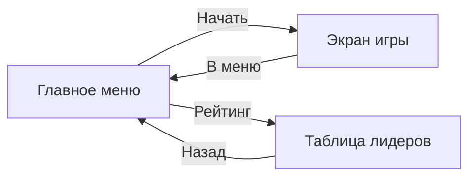
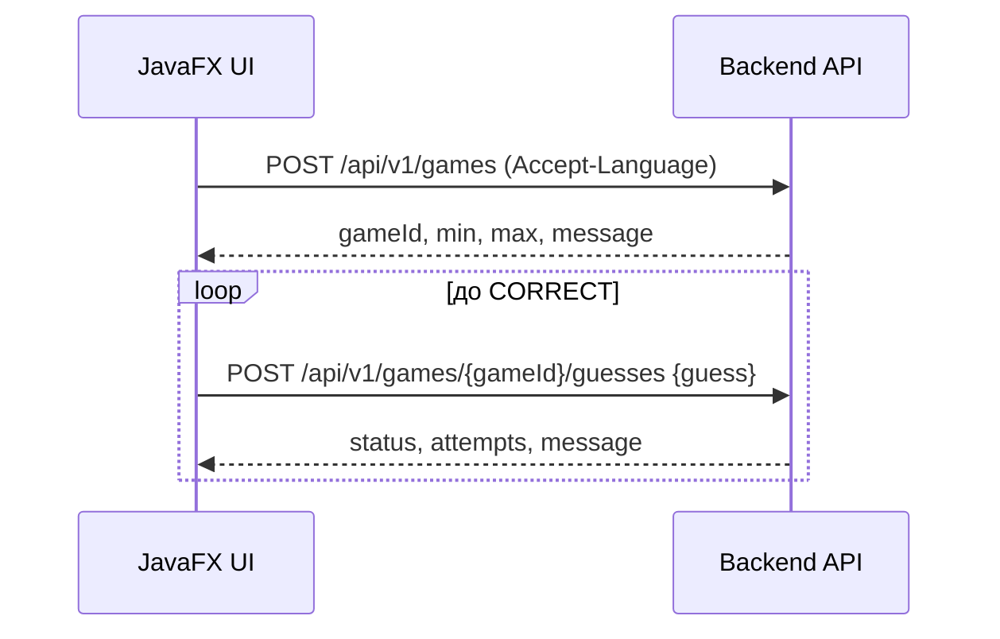

# Проектирование экранов (Front)

Цель: показать разделение ответственности **Front / Back**, спроектировать 3 экрана и явно указать, какие данные берём из **API**, а какие — из **локальных ресурсов**.

## Общая схема навигации

---

## Экран 1. Главное меню

### Назначение
Точка входа: запуск игры, переход к таблице лидеров, смена языка.

### Компоненты
- Заголовок (Label)
- Текст приветствия (Label)
- Выбор языка (ChoiceBox)
- Кнопка "Начать игру" (Button)
- Кнопка "Таблица лидеров" (Button)

### Данные
- **Локально**: все строки интерфейса (ResourceBundle i18n), размеры/стили.
- **Из API**: ничего критичного. (Можно расширить: ping backend / health, но это не требуется.)

### UX-правила
- Смена языка должна немедленно отражаться в UI (перезагрузка FXML с новым ResourceBundle).

---

## Экран 2. Игра (Guess)

### Назначение
Игрок вводит число и получает подсказку: выше/ниже/угадал.

### Компоненты
- Заголовок с диапазоном (Label)
- Текст подсказки/статуса (Label)
- Поле ввода числа (TextField)
- Кнопка "Проверить" (Button)
- Счётчик попыток (Label)
- История попыток (ListView)
- Кнопка "Новая игра" (Button)
- Кнопка "В главное меню" (Button)

### Данные
- **Из API**:
  - `POST /api/v1/games` — старт игры, получение `gameId`, `min`, `max`, текста старта.
  - `POST /api/v1/games/{gameId}/guesses` — проверка числа, получение статуса и сообщения.
- **Локально**:
  - i18n строки и UI-лейаут.
  - Отображаемая история попыток (формируется на фронте на основе ответов API).

### Условная диаграмма (последовательность)

---

## Экран 3. Таблица лидеров

### Назначение
Показ лучших результатов (минимум попыток, затем время).

### Компоненты
- Заголовок (Label)
- Таблица (TableView) с колонками: Rank, Attempts, Duration, Date
- Строка статуса (Label): "пусто"/"ошибка"/"ок"
- Кнопка "Обновить" (Button)
- Кнопка "Назад" (Button)

### Данные
- **Из API**:
  - `GET /api/v1/leaderboard?limit=10` — выдача отсортированных записей.
- **Локально**:
  - i18n строки и отображение/форматирование дат.

### Реализация
Этот экран реализован полностью (уровень "на 5"): UI + загрузка данных из API + обработка ошибок.
